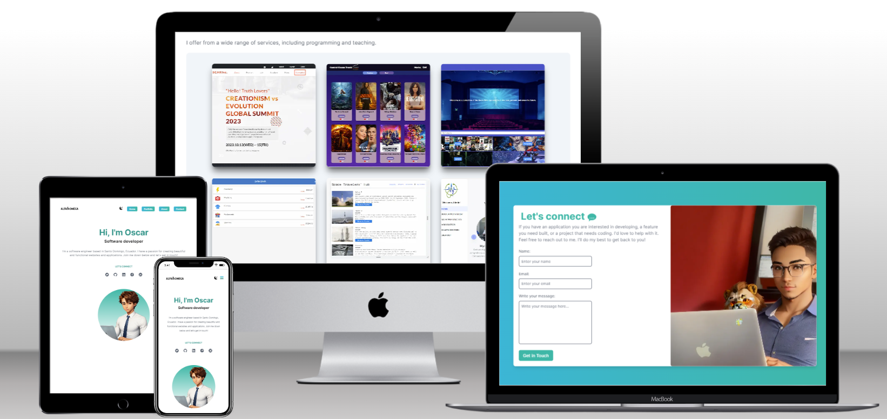
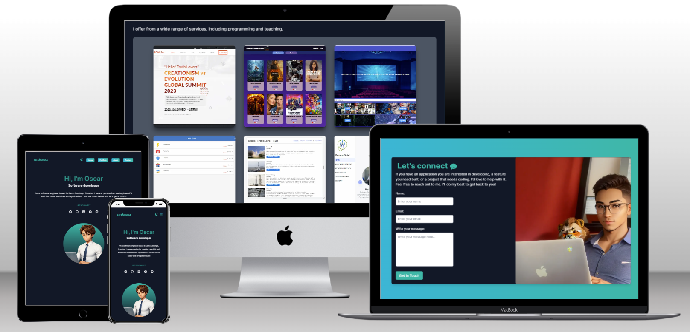

<a name="readme-top"></a>


<div align="center">

  <h1><b>Oscar Villagran's Portfolio</b></h1>
  
  <br>
  
</div>

<!-- TABLE OF CONTENTS -->

# 📗 Table of Contents

- [📗 Table of Contents](#-table-of-contents)
- [📖 Portfolio Project: Setup and mobile first](#-portfolio-project-setup-and-mobile-first)
  - [🛠 Built With ](#-built-with-)
    - [Tech Stack ](#tech-stack-)
    - [Key Features ](#key-features-)
  - [🚀 Live Demo ](#-live-demo-)
  - [💻 Getting Started ](#-getting-started-)
    - [Prerequisites](#prerequisites)
    - [Setup](#setup)
    - [Install](#install)
    - [Usage](#usage)
    - [Deployment](#deployment)
  - [👥 Authors ](#-authors-)
  - [🔭 Future Features ](#-future-features-)
  - [🤝 Contributing ](#-contributing-)
  - [⭐️ Show your support ](#️-show-your-support-)
  - [🙏 Acknowledgments ](#-acknowledgments-)
  - [📝 License ](#-license-)

<!-- PROJECT DESCRIPTION -->

# 📖 Portfolio Project: Setup and mobile first<a name="about-project"></a>


**Portfolio Project: Setup and mobile first** is a web app built using [Next.js](https://nextjs.org/), bootstrapped with [`create-next-app`](https://github.com/vercel/next.js/tree/canary/packages/create-next-app), React and Tailwind CSS, it is intended to show my latest project as a full stack web developer.

## 🛠 Built With <a name="built-with"></a>

### Tech Stack <a name="tech-stack"></a>


<details>
  <summary>Javascript</summary>
  <ul>
    <li>Next.js</li>
    <li>React</li>
  </ul>
</details>

<details>
  <summary>CSS</summary>
  <ul>
    <li>Tailwind CSS</li>
  </ul>
</details>

<!-- Features -->

### Key Features <a name="key-features"></a>


- **Dynamic Cards**
- **Use of react state**
- **Use of Routes**
- **Use of Contac Form**

<p align="right">(<a href="#readme-top">back to top</a>)</p>

<!-- LIVE DEMO -->

## 🚀 Live Demo <a name="live-demo"></a>

- Here you can see a [Live Demo](https://oovillagran.github.io/Portfolio-project/) of my project.

<p align="right">(<a href="#readme-top">back to top</a>)</p>


<!-- GETTING STARTED -->

## 💻 Getting Started <a name="getting-started"></a>

To get a local copy up and running, follow the following steps steps.

### Prerequisites

In order to run this project you need:

- Create a repo on your repositores files.
- Clone or make a copy of this repo on your local machine.
- Follow GitHub flow.
- A carefully reading of this README.md is required.


### Setup

Clone this repository to your desired folder:
 
 ```bash
 cd my-folder
 git clone git@github.com:oovillagran/portfolio.git
```

### Install

Install this project with:

 ```bash
 npm install
```

Run the development server:

```bash
npm run dev
# or
yarn dev
# or
pnpm dev
```

### Usage

To run the project, you can use your favorite browser.
Open [http://localhost:3000](http://localhost:3000) with your browser to see the result.

You can start editing the page by modifying `app/page.js`. The page auto-updates as you edit the file.

This project uses [`next/font`](https://nextjs.org/docs/basic-features/font-optimization) to automatically optimize and load Inter, a custom Google Font.


### Deployment

- You can deploy this project using GitHub pages.

<p align="right">(<a href="#readme-top">back to top</a>)</p>

<!-- AUTHORS -->

## 👥 Authors <a name="authors"></a>


👤 **Oscar Villagran**

- GitHub: [@oovillagran](https://github.com/oovillagran)
- Twitter: [@oovillagran](https://twitter.com/oovillagran)
- LinkedIn: [Oscar Villagran](https://www.linkedin.com/in/oovillagran/)

<p align="right">(<a href="#readme-top">back to top</a>)</p>

<!-- FUTURE FEATURES -->

## 🔭 Future Features <a name="future-features"></a>


- [ ] **Use README template file**
- [ ] **Add more feature projects**
- [ ] **Ask for a code review**

<p align="right">(<a href="#readme-top">back to top</a>)</p>

<!-- CONTRIBUTING -->

## 🤝 Contributing <a name="contributing"></a>

Contributions, issues, and feature requests are welcome!

Feel free to check the [issues page](../../issues/).

<p align="right">(<a href="#readme-top">back to top</a>)</p>

<!-- SUPPORT -->

## ⭐️ Show your support <a name="support"></a>


If you like this project feel free to make any comment, all contributions are welcome!.

<p align="right">(<a href="#readme-top">back to top</a>)</p>

<!-- ACKNOWLEDGEMENTS -->

## 🙏 Acknowledgments <a name="acknowledgements"></a>

I would like to thank Microverse comunity, especially reviewers guys, they do an excellent job. I thank my learning, morning session and standup partners for supporting me.

<p align="right">(<a href="#readme-top">back to top</a>)</p>

## 📝 License <a name="license"></a>

This project is [MIT](LICENSE) licensed.

<p align="right">(<a href="#readme-top">back to top</a>)</p>
